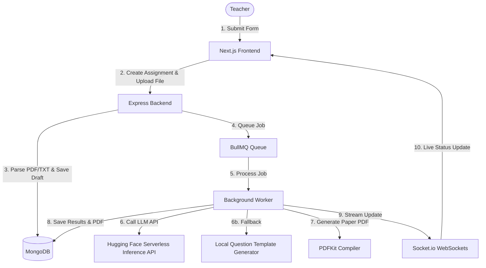

# VedaAI – AI Assessment Creator

VedaAI is a full-stack AI Assessment Creator designed for teachers to generate customized, structured question papers (along with PDF exports and answer keys) based on course details and reference files.

## Project Architecture



### Tech Stack
- **Frontend**: Next.js 15 (TypeScript, Zustand, TailwindCSS v4, Lucide icons, Socket.io-client)
- **Backend**: Node.js + Express (TypeScript, Mongoose, Redis, BullMQ, Socket.io, PDFKit, PDF Parse)
- **AI**: Hugging Face Inference API (`meta-llama/Meta-Llama-3-8B-Instruct`) with robust **offline mock fallbacks** for developer sandbox testing.

---

## Key Features

1. **Assignment Creation Form**: Multi-step wizard supporting file uploads (PDF/TXT), due dates, and a dynamic question type list builder with aggregate totals.
2. **Real-time Pipeline Tracking**: Integrated Socket.io connection streaming BullMQ background worker steps (`Queued` $\rightarrow$ `Generating Questions` $\rightarrow$ `Generating PDF` $\rightarrow$ `Ready`).
3. **Structured Exam Paper Renders**: Professional layout featuring header details, student info blocks, difficulty color badges (Easy, Moderate, Hard), and expandable Answer Keys.
4. **Offline Resilience**: Automatically falls back to high-quality locally generated mock question structures (using context words from uploaded documents) in case of rate-limiting or network issues.
5. **PDF Export**: Worker-generated exam paper compile using PDFKit ready for printing or direct download.

---

## Local Setup & Development

### 1. Prerequisites
- **Node.js** (v18+)
- **MongoDB** & **Redis** (or Cloud URIs)

### 2. Configure Environment Variables
Create a `.env` file in the `backend/` directory:
```env
PORT=5001
MONGODB_URI=mongodb://127.0.0.1:27017/vedaai
REDIS_URL=redis://127.0.0.1:6379
HF_TOKEN=your_hugging_face_token_here
```

Create a `.env.local` file in the `frontend/` directory:
```env
NEXT_PUBLIC_API_URL=http://localhost:5001
```

### 3. Running Services (Docker Compose)
If you have Docker running, spin up local databases:
```bash
docker compose up -d
```
*Note: If MongoDB/Redis are not installed locally, the backend will auto-detect connection failures and fall back to local mocks so you can still test the full frontend creation flow.*

### 4. Install & Run Backend
```bash
cd backend
npm install
npm run dev
```

### 5. Install & Run Frontend
```bash
cd ../frontend
npm install
npm run dev
```
Open `http://localhost:3000` to view the app!

---

## Testing / Verification Commands
Verify core services independently:

- **AI Prompt Formatting & Parser Test**:
  ```bash
  cd backend
  npm run test-ai
  ```
- **PDF Compilation & Layout Test**:
  ```bash
  cd backend
  npm run test-pdf
  ```
  *(Saves a test question paper file at `backend/test_exam_paper.pdf`)*

---

## Deployment on Render

This project is configured to run the Express API and the BullMQ background worker in the **same Node.js process**. This simplifies hosting costs on Render by combining the server and queue processor into a single Web Service.

### 1. Databases Setup
1. Create a free shared cluster on **MongoDB Atlas** and get your connection string.
2. Create a free Redis instance on **Upstash Redis** (which persists forever) and copy the Redis URL.

### 2. Deploy Backend (Express + BullMQ)
1. Link your GitHub repo to Render as a **Web Service**.
2. **Runtime**: Node
3. **Build Command**: `cd backend && npm install && npm run build`
4. **Start Command**: `cd backend && npm run start`
5. Configure Environment Variables:
   - `MONGODB_URI`: `<Atlas Connection String>`
   - `REDIS_URL`: `<Upstash Redis URL>`
   - `HF_TOKEN`: `<HuggingFace Key>`

### 3. Deploy Frontend (Next.js)
1. Link your GitHub repo to Render as a **Web Service** or **Static Site**.
2. **Build Command**: `cd frontend && npm install && npm run build`
3. **Start Command**: `cd frontend && npm run start`
4. Configure Environment Variables:
   - `NEXT_PUBLIC_API_URL`: `<Deployed Render Backend URL>`
